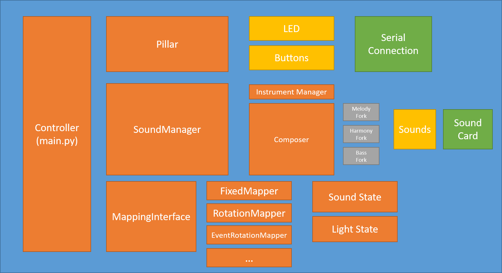

# Konstanz 2024 (Portable Pillar V1)

## Concept

We have two pillars made of a number of sub-tubes. 

- Each sub-tube can be interacted with using capacitive touch
- Each sub-tube can be lit up by a set of LEDs
- Eac pillar will generate some sounds

This uses the V3 Forest setup but with a new sound generation system. Designated V3S.

This version is set up for the Konstanz event where:

- Narrative...
- Sounds
    - For each pillar, three layers of bass, melody and "user" 
    - Bass is now a supercollider synth "Inception style" electronica rumble bass
    - Melody is a randomly chosen melody played on an SC Synth ("harmony")
    - User uses "melody" synth and is triggered directly by button presses, or by button presses from a different pillar. 
- Lights... 


## Usage

Install scamp and scamp_extensions

```
pip3 install --user scamp scamp_extensions
```

> *Note*: You will also need to now install scsynth (supercollider) for scamp to use! 


Then run the following to start it up

```
python src/main.py 
```


It will read the configuration at `config/config.json` with the parameters linked to the hostname of the sytem.

> **Note**: If running locally, you will need to give the `--hostname` argument set to one of the hostnames within the `config.json`, e.g. `--hostname fon003`. 

> **Note**: If running on a new Raspberry Pi you will need to add a configuration for it within config.json

### MQTT

> *Note*: For MQTT you will need to `pip3 install paho_mqtt` 

You will need to run a MQTT Broker such as `mosquitto` and set the `config["mqtt"]["broker_ip"]` to the ip address. For testing you can also overwrite using the `--mqtt_broker_ip` argument when running `src/main.py` 

### Local Testing

The above works if running on one of the designated FONPIs. However we have also built a utility for local testing of the sound system. 

You can start a virtual serial port using `socat` this is encapusalted in the tmux_session.yaml

> You will need to `sudo apt-get install tmux tmuxinator pygame`

```bash
./testing/arduino_test_environment.sh
```

It will then show you the names of the virtual serial ports. Use these to connect up `main.py` and the pretend interface

Run the pretend frontend using

```bash
python3 testing/mock_teensy --port <serial port from socat>
# e.g.
python3 testing/mock_teensy --port /dev/pts/4
```

And run the forest

```bash
python3 src/main.py --serial_port <other socat port> --hostname <pretend hostname>
# e.g.
python3 src/main.py --serial_port /dev/pts/3 --hostname fon006
```

 

## What it does



### Sound Manager

The Sound Manager now interacts iwth scamp instead of sonic pi to generate sounds. 

The Mapping Interface defines a method of interaction between the touch, light and sound

The `src/interfaces.py` defines the primary datastructures including:

- The instruments (from scamp)
- The scales (from scamp_extensions)
- The melodies
- The baselines
- **The default state**

**Currently to change the initial defaults of the system you will need to manually change this default state**

### Pillar Communications

I have added an MQTT Connection on the pillars which needs integration and testing

Currently in `main.py` there are two functions which act as publisher and subscriber. 

Designed such that if a button is pressed, it is immediately broadcast to all other listening pillars via a `/sound_state/<hostname>` topic with a json packet representing the sound state (`mapping_interface.py`). 

The `on_other_pillar_receive` function will then tell the sound manager to play the exact same note with some fixed delay given by the `config["broadcast"]["echo_delay_duration"]`. 


## Usage Notes

1. In this new version, the configuration file is linked to the hostname of the machine using it. 
2. Some things are hardcoded look around. especially in DEFAULT_STATE in interfaces

Need to refactor some of this out. 
